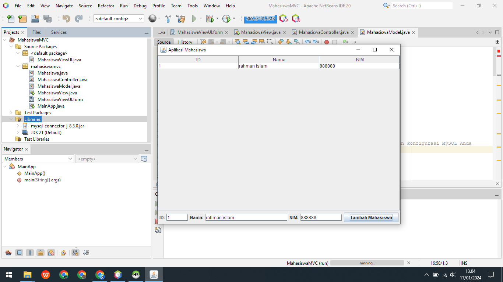
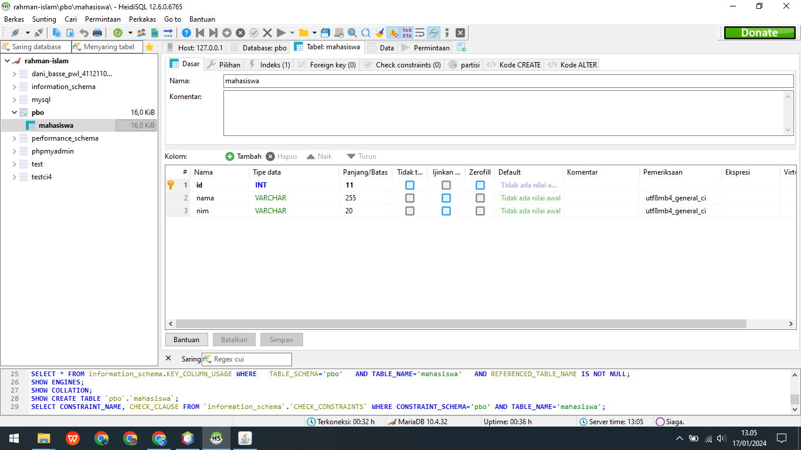
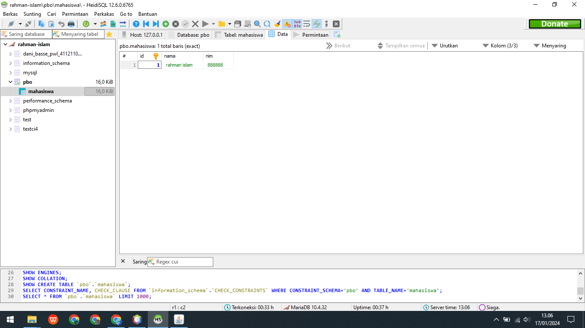
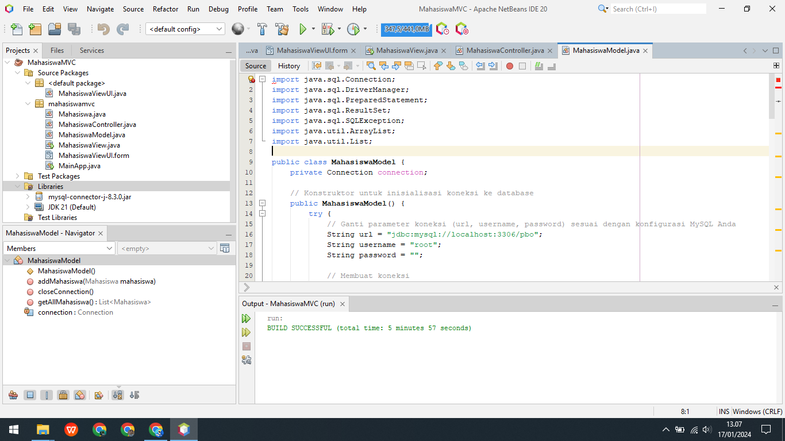

# MahasiswaMVC

program sederhana mahasiswa

## requirement/kebutuhan

Connector/J 8.3.0 - yang terbaru
mysql jdbc driver: https://dev.mysql.com/downloads/connector/j/
untuk yang windows menggunakan **platform independent**

### hasil program

itu tadi adalah tampilan dari program tersebut terimakasih !
